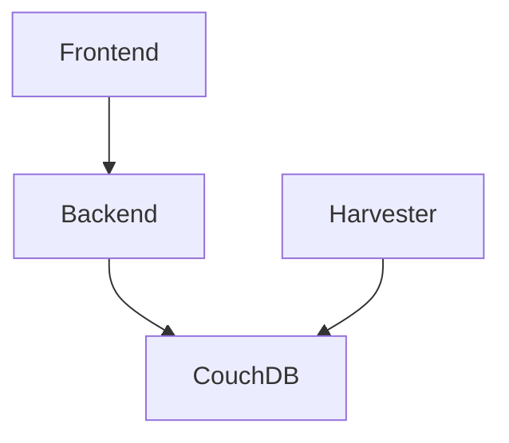

# COMP90024 Assignment 2


## Deployment

To deploy this project run:

```bash
  cd playbook
  ./run-mrc.sh
```

- You would need the `id_rsa` ssh private key in the `playbook` folder, if you want to deploy the playbook with a clean slate. 
- You would need to replace the `ansible_become_pass` variable in the `inventory/inventory.ini` file with your sudo password. 
- You would need to set up your MRC password and provide it upon the input prompt when executing the script.

p.s. Due to the intrinsics of docker swarm, the CouchDB cluster may not finish its setup sometimes. The deployment process may fail or throw errors. Let me know if that happens. 

## Documentation

- CouchDB
    - [x] Docker Swarm Deployment
    - [ ] Photon
    - [ ] Secret Hiding via Ansible Vault
    - [ ] DB Admin credentials are open in the repo, may need to update it to use ansible vault, but it's low priority for now.
- Harvester
    - [ ] Elaboration
    - [x] Docker Swarm Deployment
- API
    - [ ] Elaboration
    - [x] Docker Swarm Deployment
- Frontend
    - [ ] Elaboration
    - [x] Docker Swarm Deployment
- Analyser
    - [ ] Elaboration
    - [ ] Development
    - [ ] Docker Container Deployment
    
## Notes
CouchDB cluster is ready to play with. Go to MRC and find our project. You can use any instance's IP to access it. The url to the GUI is `<IP>:5984/_utils/`. Username and password can be found [here](/playbook/variables/couchdb-vars.yaml#L6-L7).
React frontend is accessible on port 90 and Gin backend hosts a swagger page, which is accessible on port 8080.

Current sevice communication map is shown as below:

Frontend, Backend and Harvester all have two replicas.

Some thrid party libraries (like `ibmcloudant` in harvester) are installed for demonstration and testing purposed. If they don't perform or lack usability, feel free to find other options. Let me know if you want to change them or need more packages. 

If you are not on campus and want to deploy the playbook or play with the services, use the AnyConnect VPN.
